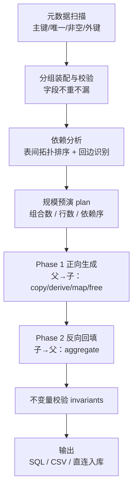

# tableseed

> 多表联合造数工具 —— 用「字段分组」描述单表规则，用「表间关系」描述跨表联动，生成一致、可入库、覆盖可证明的测试数据。

```
表结构 + 表间关系 + 字段分组规则  ──►  tableseed  ──►  SQL / CSV / 直连入库
```

## 文档

| 文档 | 内容 |
| --- | --- |
| [docs/PRD.md](docs/PRD.md) | 需求规格：功能清单（FR-1 ~ FR-10）、非功能需求、验收标准、里程碑、风险 |
| [docs/tech-design.md](docs/tech-design.md) | 技术方案：选型总表、架构分层、目录结构、IR 数据结构、关键算法、表达式引擎、配置 Schema |
| 本 README | 模型定义：模型一「字段分组」、模型二「表间关系」 |

---

## 它要解决什么

单表随机造数很容易，难的是**多表联动**与**数据规则**：

| 痛点 | 具体表现 |
| --- | --- |
| 关联断裂 | 流水表的 `acct_no` 在主表里查不到，外键直接炸 |
| 配对缺失 | 交易表造了 100 条，详情表只跟上 87 条，对不上账 |
| 字段不同步 | 同一笔交易，交易表币种是 CNY，详情表写成 USD |
| 口径不符 | 明细汇总与主表金额对不上，数据核对场景无法使用 |
| 规则散落 | 枚举取值、码值描述、边界值写死在几十份 INSERT 脚本里，改一处漏三处 |
| 同组不同步 | `status_code` 改成 `02`，`status_desc` 还是「正常」，造出脏数据 |
| 覆盖不足 | 只造了「正常 + 人民币 + 柜面」，其余组合从未被验证，却报"已测" |
| 覆盖爆炸 | 想全组合覆盖，`4×3×5×8` 一乘就是几百上千行，人工排不动 |
| 不可复现 | 随机造数每次结果不同，缺陷无法稳定重现 |
| 状态跳跃 | 造出「已销户却仍有在途交易」这类业务上不可能存在的组合 |
| 验证靠终端 | 改一行配置跑一次命令，看不见数据长什么样，排查全靠打印 |
| 入库后看不见 | 想确认数据是否真进去了，还得切到数据库客户端另开一个窗口 |

---

# 模型一：字段分组（Field Group）

描述**单表**的造数规则，三层结构：

```
表（Table）  ──►  字段组（Field Group）  ──►  取值（Value）
```

## 1.1 分组是完备划分

一张表的字段被划分为若干**互不相交的组**：

- 每个字段**恰好属于一个组**，不重不漏（`check` 命令强制校验）；
- 一个组**可以包含多个字段**；
- **组是造数的最小规则单元** —— 造数时以组为单位决定取值，而不是以字段为单位。

组内多字段一次生成一个**取值元组**，因此组内字段天然同步，不可能出现「码值变了描述没变」：

```yaml
- type: enum
  name: g_status
  fields: [status_code, status_desc]      # 同一组的两个字段
  values:
    - ["01", "正常"]                       # 一个取值 = 多个字段的联合取值
    - ["02", "冻结"]
    - ["03", "销户"]
```

> `status_code = "02"` 时，`status_desc` 必然是「冻结」。同步关系由分组模型保证，不依赖人工维护。

## 1.2 组类型

九种组类型，按**参与生成的方式**分为三类：

| 类型 | 语义 | 参与笛卡尔积 | 阶段 | 典型用例 |
| --- | --- | :---: | :---: | --- |
| `enum` 枚举组 | 显式列举有限取值集合（元组列表） | ✅ | P1 | 状态、币种、渠道、产品码 |
| `boundary` 边界组 | 枚举的语义化变体，专列边界与异常值 | ✅ | P1 | 金额上限、超长字符串、`NULL` |
| `dict` 字典组 | 从外部字典/码表取有限取值 | ✅ | P1 | 行名行号、地区码、机构码 |
| `sequence` 自增组 | 按起始值/步长推进，支持格式化模板 | ❌ | P1 | 流水号、账号、序号 |
| `random` 随机组 | 按生成器随机取值：区间、正则、加权分布 | ❌ | P1 | 金额、日期、姓名 |
| `const` 不变组 | 全批数据取同一常量元组 | ❌ | P1 | 租户号、机构号、环境标识 |
| `derive` 派生组 | 由**同表**其他字段表达式计算得出 | ❌ | P1 | 手续费 = 金额 × 费率 |
| `ref` 引用组 | 取自其他表已生成的值（外键联动） | ❌ | P1 | 主表业务键 |
| `aggregate` 汇总组 | 由**子表**汇总回填到父表 | ❌ | **P2** | 笔数 = count(子行)、余额 = Σ 流水 |

**三类之分**（理解生成语义的关键）：

- **有限取值组**（`enum` / `boundary` / `dict`）—— 有确定的取值集合，参与笛卡尔积展开；
- **每行附着组**（`sequence` / `random` / `const` / `derive` / `ref`）—— 没有固定取值集，在每条已展开的行上现算，**不放大行数**；
- **跨表汇总组**（`aggregate`）—— 依赖子表结果，必须等到 Phase 2 回填；单独成类是为了让调度器能自动排期。

## 1.3 生成语义

一条数据 = **所有组取值的组合**。两类组以不同方式参与：

**① 有限取值组之间 —— 笛卡尔积（全组合）**

配置里所有有限取值组的取值集合做笛卡尔积，**每个组合生成一条数据**，从而保证组合覆盖是完备的、可计算的、可证明的。

**② 其余组 —— 在已展开的行上"附着"生成**

自增组按行推进一次，随机组按行采样一次，不变组填充常量，派生组/引用组按依赖顺序计算。它们**不放大**行数，只决定这些行上其余字段取什么值。

```
                     ┌──────── 组（字段） ────────┐
 行数 =  Π  |有限取值组取值集|      ×      基数倍数
         └ 笛卡尔积 ┘                    └ 来自父表的 1:N 关系，可选
```

**展开示例** —— 一张账户表，字段分成 3 个枚举组 + 若干非枚举组：

| 字段 | 所属组 | 组类型 | 取值集合 |
| --- | --- | --- | --- |
| `status_code`, `status_desc` | `g_status` | enum | 正常 / 冻结 —— **2** |
| `currency` | `g_currency` | enum | CNY / USD —— **2** |
| `channel` | `g_channel` | enum | 柜面 / 网银 / 手机银行 —— **3** |

→ 笛卡尔积 `2 × 2 × 3 = 12` 条数据，且 12 种组合一条不漏：

```
(01,正常) (CNY) (柜面)      (02,冻结) (CNY) (柜面)
(01,正常) (CNY) (网银)      (02,冻结) (CNY) (网银)
(01,正常) (CNY) (手机银行)   (02,冻结) (CNY) (手机银行)
(01,正常) (USD) (柜面)      (02,冻结) (USD) (柜面)
(01,正常) (USD) (网银)      (02,冻结) (USD) (网银)
(01,正常) (USD) (手机银行)   (02,冻结) (USD) (手机银行)
```

这 12 条各自的 `acct_no` 由自增组推进、`balance` 由随机组采样、`tenant_id` 由不变组恒定填充、`amount` 由派生组计算。

## 1.4 规模治理

笛卡尔积是有意为之的"覆盖放大器"，但组合数会指数增长，因此必须可控：

| 机制 | 说明 |
| --- | --- |
| `max_rows` | 硬上限，超出即报错而非静默截断 |
| `exclude` | 声明非法组合并剔除。例：`status_code == "03" and balance > 0`（已销户不该有余额） |
| `strategy: full` | 全组合（默认）。适合中小规模，覆盖可证明 |
| `strategy: pairwise` | 两两组合覆盖。组合爆炸时用最少的行数覆盖所有字段对的取值 |
| `strategy: sample(n)` | 从全组合中抽样 n 条，并输出「未覆盖组合清单」 |

无论用哪种策略，`tableseed plan` 都会先算出**理论组合总数**并打印出来，让人在做之前就知道要造多少行。

---

# 模型二：表间关系（Relation）

多表造数的难点不在"循环生成"，而在**字段如何对得上**与**行数如何配得齐**。

## 2.1 关系四要素

```yaml
relations:
  - parent: t_txn                 # 父表
    child: t_txn_detail           # 子表
    cardinality: 1:1              # ① 基数
    existence: required           # ② 存在性
    join: [[txn_no, txn_no]]      # ③ 关联锚点
    propagate: [ ... ]            # ④ 字段传播规则
```

**① 基数（cardinality）** 决定行数关系：

| 基数 | 语义 | 子表行数 | 例子 |
| --- | --- | --- | --- |
| `1:1` | 一一对应（主表 + 扩展表） | 等于父行数 | 交易表 + 交易详情表 |
| `1:0..1` | 可选扩展 | ≤ 父行数 | 只有转账交易才有对手行信息 |
| `1:N` | 一对多 | Σ 每个父行的 N | 交易表 + 交易流水明细 |
| `N:M` | 多对多 | 中间表 = 两父表行的组合取样 | 客户 × 产品 |

**② 存在性（existence）** 决定子行是否必然出现：

| 取值 | 语义 |
| --- | --- |
| `required` | 父有行则子必有行（默认） |
| `optional` | 随机决定有无，行数在 0~N 间波动 |
| `conditional` | 满足条件才有，条件表达式可引用父表字段 |

**③ 关联锚点（join）** 定义两表如何配对，同时完成主键/外键传播：

- 主键传播：`[[id, txn_id]]`，子表外键由父表主键派生；
- 业务键关联：`[[txn_no, txn_no]]`，用业务唯一键而非主键；
- 复合键：`[[branch_no, branch_no], [txn_date, txn_date], [seq_no, seq_no]]`。

**④ 字段传播（propagate）** 见下节。

## 2.2 字段传播的六种模式

「很多字段要对得上」不是一条规则，而是六种，必须分别声明：

| 模式 | 语义 | 阶段 | 例 |
| --- | --- | :---: | --- |
| `copy` | 父字段原值照抄到子字段 | P1 | `currency`、`txn_date`、`acct_no` 两表一致 |
| `derive` | 父字段经表达式/函数变换后写入子字段 | P1 | `detail_amt = parent.amount × 0.7` |
| `map` | 父表码值经映射表转换为子表码值 | P1 | 父 `txn_type` → 子 `detail_type` |
| `split` | 父的一个值拆分到 N 个子行，满足 Σ子 = 父 | P1 | 一笔 1000 拆成 3 笔明细，合计仍是 1000 |
| `aggregate` | **反向**：父字段由子表汇总得出 | **P2** | 父 `detail_count` = 子表行数 |
| `free` | 子表自由生成，仅受自身分组规则约束 | P1 | 备注、随机附言 |

```yaml
propagate:
  - {mode: copy,    from: txn_date, to: txn_date}
  - {mode: copy,    from: acct_no,  to: acct_no}
  - {mode: copy,    from: currency, to: currency}
  - {mode: derive,  to: detail_amt, expr: "src.amount * 0.7"}
  - {mode: map,     from: txn_type, to: detail_type, table: map_txn_type}
  - {mode: free,    to: remark}
```

## 2.3 1:1 关系下的覆盖分配 ⚠️

**这是最容易踩的坑。** 模型一规定"有限取值组之间做笛卡尔积"，但 1:1 关系锁定了子表行数 = 父表行数。若子表有个 3 取值的枚举组，笛卡尔积会把子表撑成 `父行数 × 3`，**基数当场就破**。

因此 1:1 下，子表的有限取值组改用**分配策略（allocation）**：

| 分配策略 | 语义 | 适用 |
| --- | --- | --- |
| `follow_parent` | 取值由父行决定（父枚举驱动子枚举） | **默认**。真实感优先：存款交易不可能「透支」 |
| `round_robin` | 在父行序列上轮转分配，100 行 3 取值 → 33/33/34 | 父未给约束时的兜底；行数不变但覆盖度仍可保证 |
| `random` | 随机分配 | 贴近生产数据的随机性 |
| `weighted` | 按权重分布分配 | 少量异常值（如 5% 冲正） |

**一句话概括这个分水岭**：

> 笛卡尔积是「放大行数换覆盖」，分配是「固定行数内保覆盖」。1:N 用前者，1:1 只能用后者。

## 2.4 条件枚举：父约束子

分组模型向表间延伸的关键一步 —— **组的取值集是动态的，可随父行变化**：

```yaml
- type: enum
  name: g_detail_status
  fields: [detail_status]
  when: "parent.txn_type == 'WITHDRAW'"        # 只在取款交易下生效
  allocation: follow_parent
  values: [["NORMAL"], ["OVERDRAFT"], ["REVERSED"]]
```

配合 `follow_parent`，父表 `txn_type` 的取值会驱动子表 `detail_status` 的取值集，造出的数据天然符合业务语义。

## 2.5 两阶段生成

`aggregate` 模式会在依赖图上形成**回边**（父 ← 子），因此生成分成两个阶段：

- **Phase 1 · 正向生成**：按表间拓扑序，父 → 子，完成 `copy` / `derive` / `map` / `split` / `free`；
- **Phase 2 · 反向回填**：按锚点聚合子表结果，更新父表的 `aggregate` 字段。

```yaml
# 父表侧的汇总字段
- type: aggregate
  name: g_detail_count
  fields: [detail_count]
  expr: "count(t_txn_detail) by txn_no"
```

典型场景：A 的交易金额合计 = B 的明细之和；银行余额表由流水汇总得出。

## 2.6 多表链与多父

- **链式传播**：A → B → C，沿 DAG 逐级传播，C 可继承 A 的字段（`copy` 支持跨级引用）；
- **多父表**：B 同时引用 A 与 D，需保证 B 的每个外键在各自父表中都能找到（**引用完整性** —— `ref` 组只能从父表已生成的行里取值，不得凭空造）；
- **N:M 中间表**：本质是「两个父表行的组合取样」，可复用笛卡尔积机制后按 `sample` / 上限裁剪。

## 2.7 不变量：把「对得上」变成可校验的断言

传播规则只保证生成时对，还要能证明对：

```yaml
invariants:
  - "每个 t_txn.txn_no 在 t_txn_detail 中恰好 1 行"
  - "t_txn_detail.currency == t_txn.currency by txn_no"
  - "t_txn.detail_count == count(t_txn_detail) by txn_no"
  - "Σ t_txn_detail.detail_amt by txn_no == t_txn.amount"
```

生成结束后逐条求值，失败即报错并列出违例行 —— **先声明口径，再验证口径**。

---

# 生成流程



# 配置样例（草案，字段名待定）

```yaml
seed: 20260910                      # 固定随机种子，结果可复现

limits:
  max_rows: 100000
  strategy: full                    # full | pairwise | sample
  exclude:
    - "t_account.status_code == '03' and t_account.balance > 0"

relations:
  - parent: t_txn
    child: t_txn_detail
    cardinality: 1:1
    existence: required
    join: [[txn_no, txn_no]]
    propagate:
      - {mode: copy,   from: txn_date, to: txn_date}
      - {mode: copy,   from: acct_no,  to: acct_no}
      - {mode: copy,   from: currency, to: currency}
      - {mode: derive, to: detail_amt, expr: "src.amount * 0.7"}
      - {mode: map,    from: txn_type, to: detail_type, table: map_txn_type}
      - {mode: free,   to: remark}

invariants:
  - "每个 t_txn.txn_no 在 t_txn_detail 中恰好 1 行"
  - "t_txn_detail.currency == t_txn.currency by txn_no"

tables:
  - name: t_txn
    groups:
      - type: enum
        name: g_txn_type
        fields: [txn_type]
        values: [["DEPOSIT"], ["WITHDRAW"], ["TRANSFER"]]

      - type: sequence
        name: g_txn_no
        fields: [txn_no]
        format: "T{seq:08d}"

      - type: aggregate
        name: g_detail_count
        fields: [detail_count]
        expr: "count(t_txn_detail) by txn_no"

  - name: t_txn_detail
    groups:
      - type: enum
        name: g_detail_status
        fields: [detail_status]
        when: "parent.txn_type == 'WITHDRAW'"
        allocation: follow_parent
        values: [["NORMAL"], ["OVERDRAFT"], ["REVERSED"]]

  - name: t_account
    groups:
      - type: enum
        name: g_status
        fields: [status_code, status_desc]
        values:
          - ["01", "正常"]
          - ["02", "冻结"]

      - type: enum
        name: g_currency
        fields: [currency]
        values: [["CNY"], ["USD"]]

      - type: enum
        name: g_channel
        fields: [channel]
        values: [["OTC"], ["EBANK"], ["MOBILE"]]

      - type: sequence
        name: g_acct_no
        fields: [acct_no]
        start: 1
        step: 1
        format: "6222{seq:012d}"

      - type: random
        name: g_balance
        fields: [balance]
        generator: weighted_int
        range: [0, 100000000]
        buckets: [0.80, 0.15, 0.05]    # 普通 / 大额 / 超大额
        scale: 2

      - type: const
        name: g_tenant
        fields: [tenant_id, branch_code]
        value: ["0001", "001"]        # 整批恒定

      - type: derive
        name: g_amt
        fields: [amount]
        expr: "balance * 0.01"
```

# CLI 草案

```bash
tableseed ui     -c seed.yaml             # 启动 WebUI：配置、预演、生成、预览、查数据都在浏览器里
tableseed plan   -c seed.yaml             # 预演：打印各表组合数/行数/依赖序，不产出数据
tableseed check  -c seed.yaml             # 校验配置：分组不重不漏、依赖无环、关系完整、组合规模
tableseed gen    -c seed.yaml             # 无数据库连接 → 只生成不落盘，返回内存对象
tableseed gen    -c seed.yaml --dsn ...   # 提供数据库连接 → 直接执行入库
tableseed gen    -c seed.yaml -o out/     # 显式落盘 SQL / CSV
tableseed verify -c seed.yaml -i out/     # 对生成结果跑 invariants 校验
```

`plan` 示例输出：

```
t_txn         枚举组: g_txn_type(3) = 3 组合                     → 3 行
t_txn_detail  1:1 绑定 t_txn，行数锁定 3 行（allocation: follow_parent）
t_account     枚举组: g_status(2) × g_currency(2) × g_channel(3) = 12 组合 → 12 行
组合总数 15，未超 max_rows(100000)                              ✓ 校验通过
```

# 设计原则

1. **声明式** —— 规则写在配置里，不写脚本；配置可 diff、可评审、可版本化。
2. **覆盖可证明** —— 组合数可计算，造出多少、漏了哪些说得清。
3. **组是原子的** —— 同组字段共进退，杜绝组内不同步。
4. **覆盖方式随行数形态而变** —— 有空间就笛卡尔积放大，没空间就分配保覆盖。
5. **只读元数据** —— 不写目标库结构，只读表定义。
6. **可复现** —— 同配置 + 同 seed = 同数据。

# Roadmap

- [ ] **M1** 元数据扫描 + 分组模型 + 单表笛卡尔积展开 + 执行策略（直连/内存）+ CLI + **WebUI 最小闭环**（配置→预演→生成→预览）+ SQL 查询台
- [ ] **M2** 表间关系：四要素 + `copy`/`derive`/`map`/`free` 传播 + 拓扑排序 + 1:1 分配策略 + WebUI 关系图
- [ ] **M3** `aggregate` 两阶段生成 + `invariants` 校验 + 覆盖策略（pairwise / sample）+ 覆盖度视图
- [ ] **M4** `split` 拆分模式 + 流式生成 + 生成后自检
- [ ] **M5** 打磨与集成：打包分发、Python API 稳定化、与测试平台集成

# 技术选型

- 主语言：Python 3.13
- CLI：Typer
- WebUI 后端：FastAPI + uvicorn（SSE 推送生成进度）
- WebUI 前端：React 19 + Vite + TypeScript + Tailwind v4
- 元数据：SQLAlchemy Inspector（可选依赖，惰性导入）
- 表达式引擎：基于 Python `ast` 的自研沙箱，语法兼容 Python + MySQL 双风格
- 数据库适配：PostgreSQL / MySQL / Oracle 兼容层（方言隔离）
- 测试：pytest + allure

> 选型理由与备选对比见 [docs/tech-design.md](docs/tech-design.md) 第 1 节。

# 状态

规格已定稿（PRD + 技术方案），代码骨架待搭建。当前仓库只有文档。

---

本仓库仅包含通用示例，不含任何具体机构的表结构、字段命名或业务规则。
